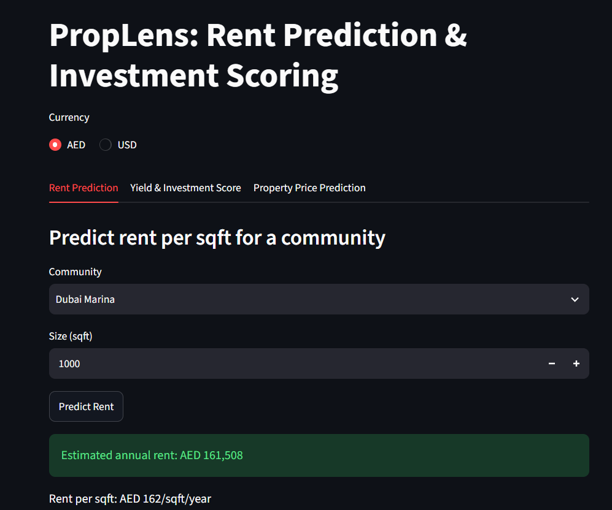
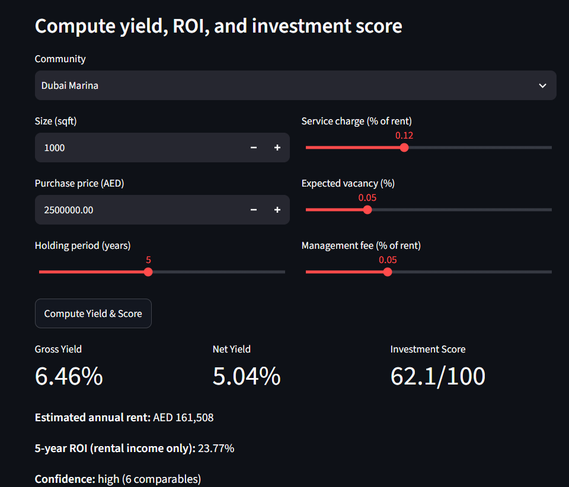
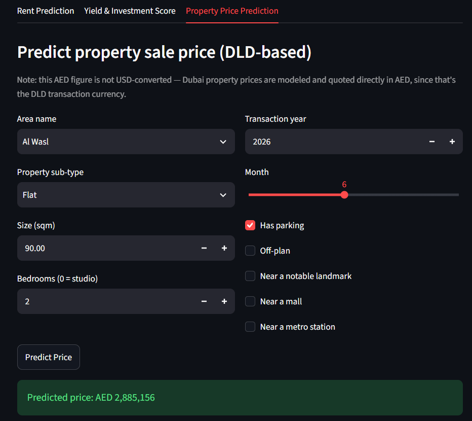

# PropLens: Dubai Real Estate Rent, Yield & Price Prediction

Rental price prediction, yield/ROI/investment scoring against real market
comparables, and DLD-based property sale price prediction with SHAP
explainability. Two prediction modules, one FastAPI backend, one Streamlit
frontend.

## Screenshots





-->

## Structure

```
├── data/{raw, processed, processed_price}/   # CSVs (not committed)
├── src/
│   ├── data_pipeline.py, train.py, evaluate.py, yield_engine.py   # rent module
│   └── price/
│       ├── data_pipeline.py, train.py, calibrate.py, explain.py
│       └── spot_check.py, full_validation.py
├── models/{, price/}                          # trained models (not committed)
├── api/main.py                                # FastAPI: rent, yield, price endpoints
├── frontend/app.py                             # Streamlit: 3 tabs
└── scripts/full_system_check.py                # combined validation across all 3
```

## Key findings

**Rent module** (community-month panel, likely formula-generated data —
price/rent correlation = 0.9999, documented not overclaimed):
- Caught and fixed a target-leakage feature (`price_to_rent_ratio` using
  current-row target) that produced a false R2=1.0
- Beat a naive "last month's rent" baseline by ~30x, confirming real signal
- Yield barely varies by community (std=0.095pp) — investment score weighted
  toward demand/price-momentum instead (20/35/30/15% yield/demand/momentum/confidence)
- Fixed 3 related bugs in the no-comparables fallback, all the same class:
  contradictory feature signals (price vs. an unrelated community's rent history)

**Price module** (real DLD sales transactions, 1.77M raw rows):
- Filtered Mortgages out of `actual_worth` (23% of rows) — likely root cause
  of the original project's "predictions too high" problem
- Dropped `meter_sale_price`, an exact `price/area` leak computed by DLD itself
- Caught sub-2-sqm data entry errors that slipped past ratio-based outlier filtering
- Leakage-safe (out-of-fold) target encoding for 70 Dubai areas
- Fixed systematic underprediction for 2025-2026 (tree models can't extrapolate
  past their training date range) via trend calibration: bias -7.0% → +0.7%
- Confidence flag (low/medium/high) validated across the full 250K-row test
  set: low-confidence MAPE (37%) meaningfully worse than high-confidence (16%)
- Final: R2 ~0.83-0.85, MAPE ~16%, SHAP explainability per prediction

**Known limitations**: rent data may not reflect real messy listings; no
building/floor/view features caps per-unit accuracy in both modules; some
areas (e.g. Al Safouh Second) have high within-area variance the model can't
resolve without those features.

## Setup & run

```bash
pip install -r requirements.txt
```

Rent: `data/raw/dubai_rent.csv` → Price: `data/raw/dld_transactions_part1.csv` + `part2.csv`

```bash
# Rent module
python src/data_pipeline.py --input data/raw/dubai_rent.csv
python src/train.py --data_dir data/processed --model_dir models
python src/evaluate.py --data_dir data/processed --model_dir models

# Price module
python src/price/data_pipeline.py --inputs data/raw/dld_transactions_part1.csv data/raw/dld_transactions_part2.csv
python src/price/train.py --data_dir data/processed_price --model_dir models/price
python src/price/calibrate.py --data_dir data/processed_price --model_dir models/price

# Combined check across all 3 (rent, price, investment score)
python scripts/full_system_check.py

# App (two terminals)
uvicorn api.main:app --reload --port 8000
streamlit run frontend/app.py
```

`http://localhost:8000/docs` for interactive API testing.

## API endpoints

| Endpoint | Purpose |
|---|---|
| `GET /health` | confirms models/data loaded |
| `GET /communities` | rent-panel communities (for dropdowns) |
| `GET /price-areas` | price-model areas (for dropdowns) |
| `POST /predict-rent` | rent/sqft estimate, no price needed |
| `POST /yield-score` | gross/net yield, ROI, investment score |
| `POST /predict-price` | sale price + SHAP drivers + confidence |

## Test samples (one per tab, in the Streamlit app)

**Tab 1 — Rent Prediction**
- Community: `Dubai Marina`, Size: `1000` sqft → expect ~$44/sqft/year, ~$44,000/year

**Tab 2 — Yield & Investment Score**
- Community: `Dubai Marina`, Size: `1000` sqft, Price: `AED 2,500,000` (≈$681K),
  defaults for holding period/costs → expect gross yield ~6.4%, net yield ~5.0%,
  confidence "high"
- Try `Emirates Hills` at a proportionally higher price (~AED 4,500,000 for
  1000 sqft) to see a materially different investment score, confirming the
  score actually discriminates between communities

**Tab 3 — Property Price Prediction**
- Area: `Al Wasl`, Size: `90` sqm, Bedrooms: `2`, Year: `2026`, Month: `6`
  → expect ~AED 2.2M, confidence "high", SHAP drivers led by area/time-trend
- Try an area with little history (if shown in the dropdown as available but
  thin) to confirm a "low" confidence warning appears in the UI, not just the API

## Honest caveats for resume/interview use

Rent module's resume claim should say "listing/panel data," not DLD — only
the price module is genuine DLD transaction data. Neither module has
building/floor/view-level features. Investment score weights are tuned to
this dataset's specific (flat-yield) characteristics.